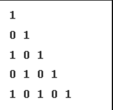
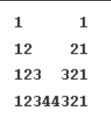
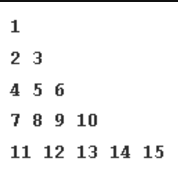
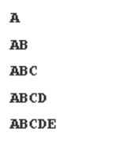

# Java Patterns Program Documentation

This document provides an overview of a Java class `Patterns` that generates different patterns based on an integer input `x`. Each pattern method prints a unique visual representation, including rows of asterisks and numerical sequences.

## Table of Contents
- [Introduction](#introduction)
- [Class and Methods](#class-and-methods)
  - [Method: `pattern1`](#method-pattern1)
  - [Method: `pattern2`](#method-pattern2)
  - [Method: `pattern3`](#method-pattern3)
  - [Method: `pattern4`](#method-pattern4)
  - [Method: `pattern5`](#method-pattern5)
  - [Method: `pattern6`](#method-pattern6)
  - [Method: `pattern7`](#method-pattern7)
  - [Method: `pattern8`](#method-pattern8)
  - [Method: `pattern9`](#method-pattern9)
  - [Method: `pattern10`](#method-pattern10)
  - [Method: `pattern11`](#method-pattern11)
  - [Method: `pattern12`](#method-pattern12)
  - [Method: `pattern13`](#method-pattern13)
  - [Method: `pattern14`](#method-pattern14)
- [Example Usage](#example-usage)
- [Screenshots](#screenshots)

---

## Introduction

The `Patterns` class contains methods to print various patterns. Each pattern is printed in a grid format using either asterisks (`*`) or numbers, depending on the method.

## Class and Methods

### Method: `pattern1`

Prints a solid square pattern with asterisks, where each line has `x` asterisks, repeated `x` times.

```java
    public void pattern1(int x) {
        for (int i = 0; i < x; i++){
            for(int j = 0; j < x; j++){
                System.out.print("*");
            }
            System.out.println("");
        }
    } 

    public void pattern1(int x){
        String line = "*".repeat(x);
        for (int i = 0; i < x; i++){
            System.out.println(line);
        }
    }
```

### Method: `pattern2`

Prints a right-angled triangle pattern using asterisks. The number of asterisks increases from 1 to x on each line.

```java
    public void pattern2(int x){
        for (int i = 1; i <= x; i++){
            System.out.println("*".repeat(i));
        }
    }
```
### Method: `pattern3`
Prints a right-angled triangle pattern with incremental numbers on each row. Each row contains numbers from 1 up to the current row number.
```java
    public void pattern3(int x){
        for (int i = 1 ; i <= x ;i++){
            for (int j = 1; j <= i; j++){
                System.out.print(j + " ");
            }
            System.out.println("");
        }
    }
```

### Method: `pattern4`
Prints a right-angled triangle pattern with incremental numbers on each row. Each row contains numbers from 1 up to the current row number.

```java
    public void pattern4(int x){
        for (int i = 1 ; i <= x ;i++){
            for (int j = 1; j <= i; j++){
                System.out.print(i + " ");
            }
            System.out.println("");
        }
    }
```
### Method: `pattern5`

Prints an inverted right-angled triangle pattern using asterisks. The number of asterisks decreases from `x` down to 1 on each line.

```java
    public void pattern5(int x) {
        for (int i = x; i > 0 ; i--){
            System.out.println("*".repeat(i));
        }
    }
```

### Method: `pattern6`

Prints an inverted right-angled triangle of numbers. Each row starts from 1 and continues up to the row number, decreasing by one number per line.

```java
    public void pattern6(int n){
        for (int i = n ; i > 0 ;i--){
            for (int j = 1; j <= i; j++){
                System.out.print(j + " ");
            }
            System.out.println("");
        }
    }
```

### Method: `pattern7`
Prints a centered pyramid pattern using asterisks. The number of asterisks increases by two on each line, starting with one asterisk at the top, and spaces are added for alignment.
```java
    public void pattern7(int n){
        for (int i = 0; i < n; i++){
            int spaces = n-i-1;
            System.out.print(" ".repeat(spaces));
            int stars = 2*i + 1;
            System.out.print("*".repeat(stars));
            System.out.print(" ".repeat(spaces));
            System.out.println("");
        }
    }
```

### Method: `pattern8`
Prints an inverted centered pyramid pattern using asterisks. The number of asterisks decreases by two on each line, with spaces added for alignment.
```java
    public void pattern8(int n){
        for (int i = n-1; i >= 0; i--){
            int spaces = n-i-1;
            System.out.print(" ".repeat(spaces));
            int stars = 2*i + 1;
            System.out.print("*".repeat(stars));
            System.out.print(" ".repeat(spaces));
            System.out.println("");
        }
    }
```
### Method: `pattern9`
Prints a diamond pattern using asterisks, where the upper part forms a pyramid and the lower part is an inverted pyramid. Spaces are added for alignment.

```java
   public void pattern9(int n){
        for (int i = 0; i < n; i++){
            int spaces = n-i-1;
            System.out.print(" ".repeat(spaces));
            int stars = 2*i + 1;
            System.out.print("*".repeat(stars));
            System.out.print(" ".repeat(spaces));
            System.out.println("");
        }
        for (int i = n-1; i >= 0; i--){
            int spaces = n-i-1;
            System.out.print(" ".repeat(spaces));
            int stars = 2*i + 1;
            System.out.print("*".repeat(stars));
            System.out.print(" ".repeat(spaces));
            System.out.println("");
        }
    }
```

### Method: `pattern10`
Prints an hourglass pattern using asterisks, where the number of asterisks first increases from 1 to n and then decreases back to 1.

```java
    public void pattern10(int n){
        for (int i = 1; i <= 2*n -1; i++){
            int stars = i;
            if (i > n){
                stars = 2*n -i;
            }
            System.out.println("*".repeat(stars));
        }
    }
```
### Method: `pattern11`
Prints a triangle pattern with alternating 1s and 0s. Each row starts with 1 if the row index is even and 0 if the row index is odd. The numbers alternate on each row.

```java
    public void pattern11(int n){
        for (int i = 0; i < n; i++){
            int start = 0;
            if (i % 2 == 0){
                start = 1;
            }
            for (int j = 0; j <= i; j++){
                System.out.print(start);
                start ^= 1;
            }
            System.out.println("");
        }
    }
```

### Method: `pattern12`
Prints a symmetric pattern with numbers on both sides, separated by spaces. The left side counts up from 1, and the right side counts down to 1. The number of spaces decreases as the rows progress.

```java
    public void pattern12(int n){
        for (int i = 1; i <= n; i++){
            for (int j = 1; j <= i; j++){
                System.out.print(j);
            }
            for (int j = 0; j < 2*(n-i); j++){
                System.out.print(" ");
            }
            for (int j = i; j > 0; j--){
                System.out.print(j);
            }
            System.out.println("");
        }
    }
```

### Method: `pattern13`
Prints a triangle pattern with continuous numbers. Each row starts where the previous row ended. The numbers increase sequentially from 1.

```java
    public void pattern13(int n){
        int start = 1;
        for (int i = 1; i <= n; i++){
            for (int j = 1; j <= i; j++){
                System.out.print(start + " ");
                start++;
            }
            System.out.println("");
        }
    }
```
### Method: `pattern14`
Prints a triangle pattern with letters from the English alphabet. Each row starts from 'A' and continues sequentially for the row length.

```java
    public void pattern14(int n){
       for (int i = 1; i <= n; i++){
            for (int j = 1; j <= i; j++){
                System.out.print((char) (j + 64));
            }
            System.out.println("");
        }
    }
```
## `Example Usage`
The main method demonstrates how to use the Patterns class to print each pattern. Uncomment each method call to display different patterns.

```java
public static void main(String[] args) {
    Patterns pattern = new Patterns();
    pattern.pattern1(5); // Uncomment to see pattern1
    pattern.pattern2(5); // Uncomment to see pattern2
    pattern.pattern3(5); // Uncomment to see pattern3
    pattern.pattern4(5); // Uncomment to see pattern4
    pattern.pattern5(5); // Uncomment to see pattern4
    pattern.pattern6(5); // Uncomment to see pattern6
    pattern.pattern7(5); // Uncomment to see pattern7
    pattern.pattern8(5); // Uncomment to see pattern8
    pattern.pattern9(5); // Uncomment to see pattern9
    pattern.pattern10(5); // Uncomment to see pattern10
    pattern.pattern11(5); // Uncomment to see pattern10
    pattern.pattern12(5); // Uncomment to see pattern10
    pattern.pattern13(5); // Uncomment to see pattern10
    pattern.pattern14(5); // Uncomment to see pattern10

}
```

## `Screenshots`
## Pattern 1 Example Output


## Pattern 2 Example Output


## Pattern 3 Example Output


## Pattern 4 Example Output


## Pattern 5 Example Output


## Pattern 6 Example Output


## Pattern 7 Example Output


## Pattern 8 Example Output


## Pattern 9 Example Output


## Pattern 10 Example Output


## Pattern 11 Example Output


## Pattern 12 Example Output


## Pattern 13 Example Output


## Pattern 14 Example Output
